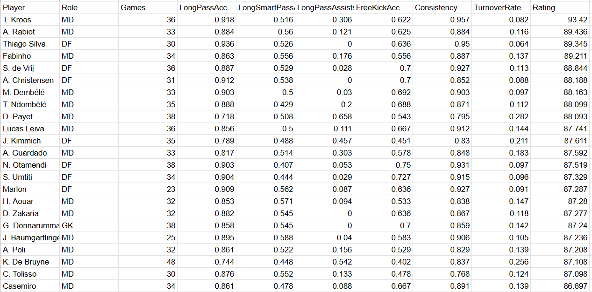

# ⚽ Football Data

This repository provides tools and scripts for analyzing football player performance using detailed event-level match data. It includes rating modules for actions like crossing, passing, dribbling, and more, based on Wyscout-compatible data.

## 📁 Repository Structure

- `events/` – Raw Wyscout event data files (JSON)
- `data/players.json` – Player metadata (IDs, names, roles)
- `ratings/` – Output CSVs with player ratings
- `scripts/` – Python scripts for computing action-specific ratings

## 🚀 Features

- Heatmaps and directional maps for all player events

- Player ratings for technical actions: crossing, passing, etc.

- Match-aware metrics with consistency and turnover modeling
- Role-based contextual normalization for fairness across positions
- Modular Python scripts for easy customization and extension

## ⚙️ How Rating Works

Each rating module outputs a single score (0–100 scale) for a player, based on:

- **Accuracy** – Success rate of the action (e.g. successful crosses)
- **Volume** – Actions per match (e.g. crosses per game)
- **Effectiveness** – Key outcomes (e.g. key passes from crosses)
- **Consistency** – Match-to-match variability in performance
- **Turnover Rate** – Rate of failed or dispossessing actions
- **Games Played** – Adjusts rating stability based on match count

Different modules (crossing, passing, dribbling, etc.) use different weights for these components depending on relevance.

## 🧰 Setup & Usage
1. Install required packages:

```sh
pip install matplotlib mplsoccer numpy
```

2. Place Wyscout event files in the `events/` folder and player metadata in `data/players.json` (extractable from `data.zip` and `events.zip`).

3. Run a script, for example:
```sh
python scripts/crossing_rating.py
```

4. Outputs will be saved in `ratings/`, such as:
- `player_crossing_rating.csv`
- `player_passing_rating.csv`
- etc.

## 🔧 Customization

You can modify:

- Metric weights (accuracy, volume, turnover, etc.)
- Minimum match thresholds for player eligibility

## 📚 References

- [Wyscout Event Data on Figshare](https://figshare.com/collections/Soccer_match_event_dataset/4415000/2)
- [Pappalardo et al., "A public data set of soccer matches"](https://www.nature.com/articles/s41597-019-0247-7)

## 📬 Contact

For questions or feedback, reach out at: **angadbsaandrai@gmail.com**

## License []([http://badges.mit-license.org](https://www.gnu.org/licenses/gpl-3.0.en.html#license-text))

<p align="center">
	Made with :heart: by <a href="https://github.com/AngadBasandrai" target="_blank">Angad Basandrai</a>
</p>